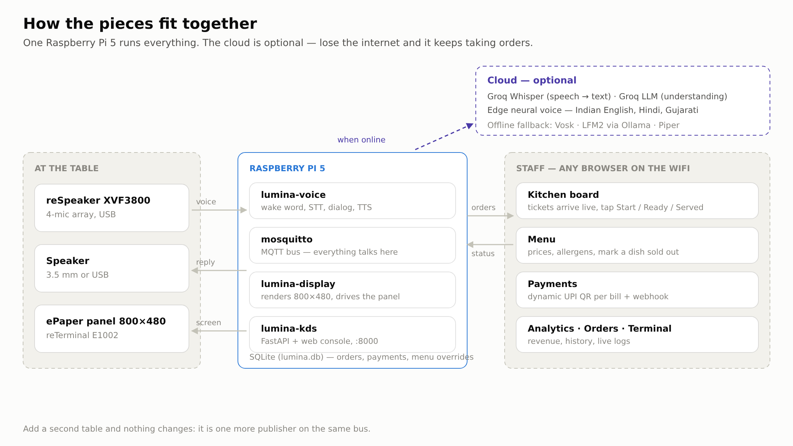
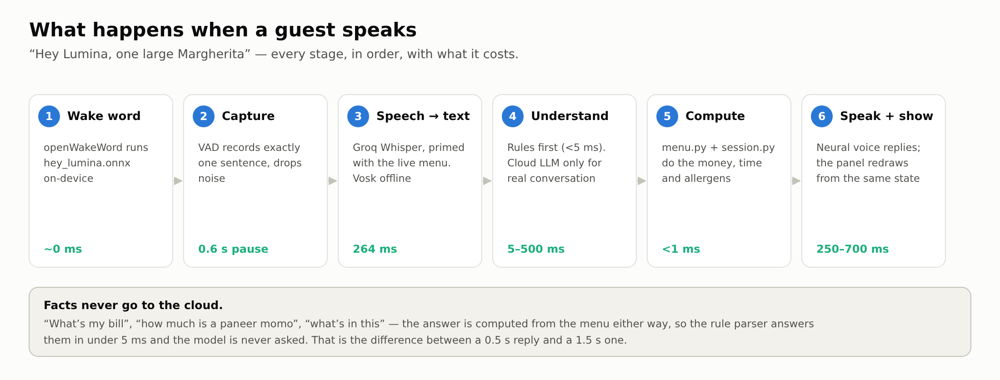
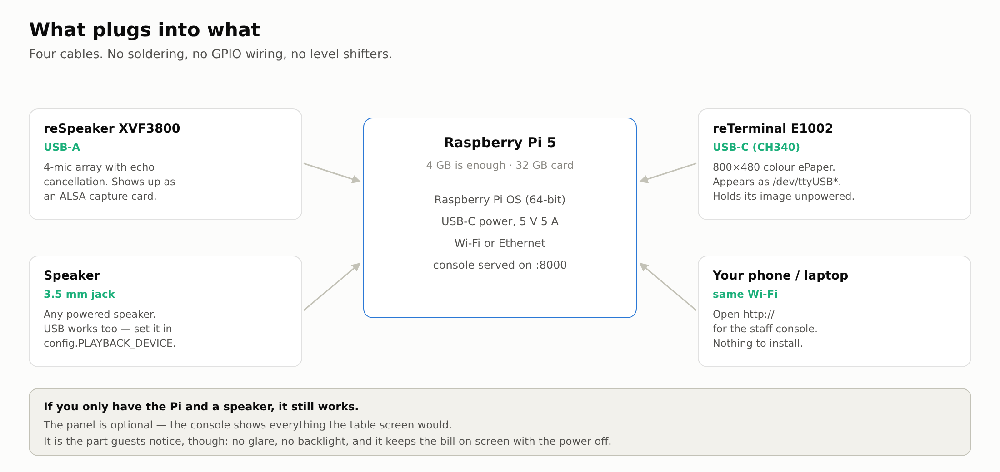
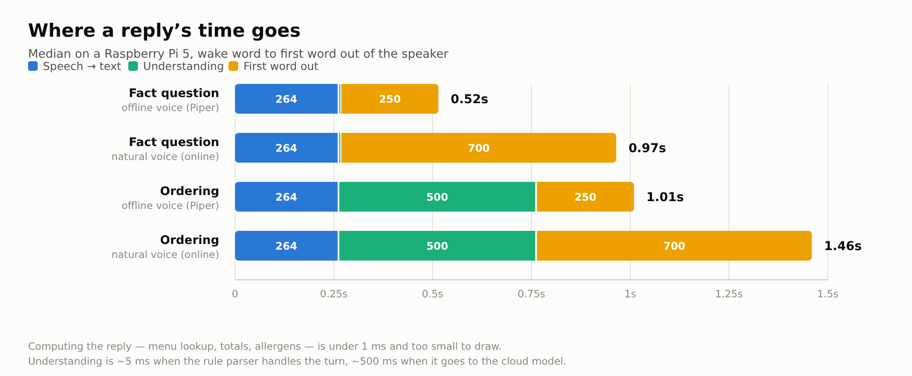

<div align="center">

# Lumina Desk

### The restaurant table that takes your order.

No app. No QR menu. No waiting for a waiter to walk past.
The guest just talks — and a paper-like screen on the table keeps up with them.

**Runs entirely on one Raspberry Pi. Keeps working with the internet unplugged.**


</div>

---

## What is this, actually?

Put a small ePaper screen and a microphone on a restaurant table.

A guest sits down, says **"Hey Lumina, one large Margherita and two cold coffees"**,
and three things happen at once:

1. **Lumina answers out loud** — "Got it, one Large Margherita and two Cold Coffees. Anything else?"
2. **The screen on the table updates** — every item, the price, what it contains, the running bill, and how long the food will take.
3. **The kitchen sees the ticket instantly** — on a browser dashboard, with allergens flagged.

When they're done they say *"bill please"*, a UPI QR appears on the table screen
for the exact amount, they pay from their phone, and the screen says thank you.
Nobody had to fetch a menu, take an order, or bring a bill.

That's the whole product. Everything below is how it's built.

> **This is running in a real pure-veg pizza outlet** — Auntyno-Z Pizza, Ghodasar —
> with all **189 dishes** from their actual menu, sizes and all.

<div align="center">

|  |  |
|:--:|:--:|
|  |  |
| **Waiting** — invites the guest, shows what they can say | **Ordering** — items, allergens, bill, ready-time |
|  |  |
| **Cooking** — the kitchen's status comes back to the table | **Paying** — dynamic UPI QR for this exact bill |
|  |  |
| **Mic off** — the device is released, not just ignored | **Done** — settled, with a feedback QR |

*These are the real 800×480 renders, generated by `ui_render.py`.*

</div>

---

## Why it's interesting

Most "AI ordering" demos fall apart the moment a real guest speaks. This one is
built around the ways they actually fail:

| The hard part | What Lumina does |
|---|---|
| **The model invents a dish or a price** | The LLM only *classifies and phrases*. Prices, totals, ETAs and allergens are computed in Python from the menu. Every dish name it returns is grounded against the real menu — it physically cannot bill you for something that doesn't exist. |
| **"No wait, I said pepperoni"** | The model sees the conversation *and* the current cart, so corrections, negation and pronouns ("add it", "remove one") work. |
| **"Is there egg in this?"** | Allergen and ingredient questions are forced down a deterministic path. It reads from the database, never from the model's memory. |
| **The internet dies mid-service** | Offline mode makes **zero network calls** — wake word, speech recognition, understanding, speech and display all run on the Pi. |
| **Offline is unusably slow** | A 700M model on a Pi CPU needs ~9 s. So a **rule parser runs first** — instant and reliably right for the handful of things guests actually say. It also answers fact questions *online*, because their reply is computed from the menu regardless. See [How fast, measured](#how-fast-measured). |
| **"What's the price of a paneer momo?"** | Answered, not ordered. A question about a dish used to put it in the cart — the fastest way to bill someone for something they never asked for. |
| **"Two cold coffee**s**"** | Understood. A strict word boundary used to reject the plural, so the dish silently never made it onto the order — and guests speak in plurals constantly. |
| **A name comes through slightly wrong** | "Momo" is a section, not a dish. Naming one gets the section read back ("we have sixteen momos, here they are") instead of a confident guess at which one you meant. |
| **The guest doesn't speak English** | Whatever language they use, Lumina replies in it. |
| **A shy guest, or a very loud room** | Three physical buttons on the panel: call a waiter, show the bill, mute. |
| **The next party inherits the last bill** | The table has a lifecycle. Payment banks the order, clears the ticket, resets the voice session and flips the table to *cleaning*. |

---

## Everything it does

### Taking an order

- **Wake word "Hey Lumina"** — a custom on-device model, no cloud, no keyword service.
- **Several dishes in one breath** — *"one large Margherita and two cold coffees"* becomes two lines with the right quantities and sizes.
- **Sizes and variants** — pizzas in Regular/Medium/Large, momos by how they're cooked, burgers by which cheese, fries by size. Say one or don't; the reply tells you which you got.
- **Corrections mid-sentence** — *"no wait, make it a large"*, *"actually remove one"*.
- **Pronouns** — *"add it"*, *"two of those"*, *"what's in it?"* resolve against what was just discussed. A pronoun can only reach something already in play, never an arbitrary dish.
- **Plurals** — *"two cold coffees"*, *"three margheritas"*.
- **Answers to its own questions** — ask *"Want the Margherita?"* and *"yes"*, *"sure"*, *"haan"*, *"ok please"* all order it. A yes with nothing pending asks what you'd like instead of guessing.
- **Mispronunciations and mis-transcriptions** — the menu carries the ways Whisper actually spells things (*margareta*, *cheezy*), and punctuation can't split a dish name in half.
- **Any language** — understood and answered in the same one, with real Indian-English, Hindi and Gujarati voices.

### Answering questions

- **What's in a dish** — read from the menu database, never improvised.
- **Allergens** — *"does the margherita have dairy?"* answers about that dish; *"I'm allergic to gluten, what can I eat?"* lists what's actually safe.
- **Prices** — *"how much is a paneer momo?"* quotes every size and orders nothing.
- **Sections** — *"what pizzas do you have?"* summarises 66 of them instead of reciting a wall of names; small sections are read in full.
- **Recommendations** — the most-ordered dishes, ending in an offer you can just say yes to.
- **The bill** — computed in Python from the menu. The model never touches a number.

### Knowing when not to speak

- **Filler is ignored.** Whisper answers silence with *"Okay."*, *"Exactly."*, *"Thank you."* — Lumina says nothing and keeps listening rather than holding a conversation with itself.
- **Noise never reaches the recogniser.** The speech threshold tracks the room's own noise floor.
- **A repeated wake word isn't an order** — someone unsure it heard them gets listened to, not answered.
- **It doesn't repeat itself.** Saying the same line twice means it didn't help the first time.

### At the table

- **Live ePaper** — order, allergens, running bill, ready-time, kitchen status, UPI QR, thank-you.
- **Three physical buttons** — call a server, show the bill, mute. They work with the microphone closed.
- **Mute means the microphone is off** — the device is released, the LED ring goes dark, and the panel says so rather than inviting you to talk to something that isn't listening.

Every screen the guest ever sees, in order. These are the real renders — the
same 800×480 images that get packed and pushed to the panel:

| Nobody has ordered yet | The order, live | The kitchen is on it |
|---|---|---|
|  |  |  |
| **Time to pay** | **Paid** | **Microphone off** |
|  |  |  |

There is no backlight and no glare, it holds the bill on screen with the power
off, and it draws nothing at all between updates.

### Paying

- **Dynamic UPI QR** — one VPA, the exact amount per bill, no payment gateway.
- **Automatic confirmation** — reads the merchant's payment emails over IMAP and settles the matching bill, deduplicated by transaction ID.
- **Webhook** for a real gateway, and a **Mark paid** button for when neither applies.
- **Feedback QR** that already knows which table it came from.

### For the kitchen and the manager

- **Live board** — tickets as they're spoken, wait timers, allergens flagged, one-tap New → Preparing → Ready → Served.
- **Table lifecycle** — available, reserved, occupied, cleaning; payment banks the order and resets the table for the next party.
- **Service requests** — *"bring water"* raises a banner until someone clears it.
- **Menu editing** — change a price or mark something sold out and it's live for the voice immediately.
- **Analytics** — revenue, average ticket, order-to-served time, peak hour, busiest tables, popular dishes.
- **Terminal** — every service's logs in the browser, no SSH.
- **Table panel controls** — redraw a stale screen with one click, or re-upload the panel's firmware from the browser when it genuinely needs it. No laptop, no remembering an arduino-cli invocation while the restaurant is open.
- **Settings** — assistant on/muted/off, brain mode, API key, tax, UPI, voice and pace, wake sensitivity, end-of-speech pause, staff PIN. All live.

### For whoever maintains it

- **`tools_doctor.py`** — exercises every backend including the fallbacks, and checks the cloud models still exist. Groq retires them without warning; this is how you hear about it from a health check instead of a guest.
- **`tests/test_offline.py`** — no mic, no network, no services. Every case is a mistake this system actually made.
- **`tests/test_live.py`** — a whole guest journey against the running system.
- **`tools_bench.py`** — times each stage of a turn.
- **[Demo script](docs/SHOOTING_SCRIPT.md)** ([PDF](docs/Lumina-Desk-demo-script.pdf)) — how to show it off, from the customer's side and the kitchen's, including the rough edges worth planning around.

## The staff side

Everything runs from one browser page on the LAN — `http://<pi>.local:8000`,
behind a staff PIN. It works on a phone, a tablet propped in the kitchen, or the
till computer.

### Kitchen — the live board
Tickets as they're spoken, wait timers that turn amber then red, allergens in red,
and one-tap New → Preparing → Ready → Served. Guest requests ("bring water") and
payment requests raise their own banner until someone clears them.


### Analytics — is the shop doing well?
Revenue, average ticket, how long an order takes from spoken to served, peak hour,
busiest tables, and what people actually order.


### Menu — change the menu by typing
Edit a price, mark something sold out, or add a new dish. It becomes orderable by
voice **immediately** — no restart, no redeploy.


### Payments — dynamic UPI QR
One VPA, a different amount per bill. Generates the QR, exposes a webhook for a
real gateway, and keeps a log of every bill and how it settled.


### Orders — every ticket ever served


### Terminal — logs without SSH
The actual `journalctl` output of every service, live, in the browser. This is how
you debug a table from your phone while standing in the shop.


### Settings — everything tunable, live
Assistant on/muted/off, online vs offline brain, API key, tax, UPI ID, wake-word
sensitivity, how long a pause means "I've finished talking", and the staff PIN.
Changes apply within a second.


---

## How it works

<picture>
  <source media="(prefers-color-scheme: dark)" srcset="docs/images/diagram-architecture-dark.png">
  
</picture>

### The pipeline, step by step

<picture>
  <source media="(prefers-color-scheme: dark)" srcset="docs/images/diagram-pipeline-dark.png">
  
</picture>

1. **Wake word** — openWakeWord runs a custom `hey_lumina.onnx` on-device. No cloud, no keyword service.
2. **Capture** — a background thread constantly drains the mic so ALSA never overflows. An energy-based VAD records exactly one sentence and throws away noise.
3. **Speech → text** — Groq Whisper (`whisper-large-v3-turbo`), primed with the live menu so dish names transcribe correctly. Vosk when offline.
4. **Understanding** — the LLM gets the conversation, the cart and the real menu. Groq `openai/gpt-oss-20b` online; LFM2-700M via Ollama offline. Most turns never reach it: the rule parser in `intents.py` classifies orders, bills and allergen questions in under 5 ms.
5. **Facts stay in code** — the model returns *intent*; `menu.py` and `session.py` compute money, time and allergens.
6. **Reply** — an online neural voice speaks it: **Indian English**, Hindi or Gujarati, not American. Piper runs resident on the Pi as the fallback and the whole of offline mode. See [The voice](#the-voice).
7. **Publish** — order and status go onto MQTT; the display service renders an 800×480 image with Pillow and streams it to the panel over WiFi.

### Why an MQTT bus

Everything is decoupled. The voice app publishes; the display service and the
kitchen dashboard subscribe. Adding a second table, a kitchen screen, or a
dashboard is just another subscriber — no changes to existing code.

```
lumina/table/<id>/order      full order + bill snapshot (retained)
lumina/table/<id>/kitchen    preparing | ready | delayed | served
lumina/table/<id>/pay        UPI link for the ePaper QR
lumina/table/<id>/payment    "paid"
lumina/table/<id>/event      staff_called | service_request | pay_requested
lumina/table/<id>/state      available | reserved | occupied | cleaning
lumina/table/<id>/button     front-panel keys
lumina/table/<id>/frame      packed 800×480 image chunks → panel
lumina/assistant             active | muted | off (house-wide)
```

---

# Build one yourself

This section assumes you've flashed a Raspberry Pi before and nothing else.
Take it in order; each step ends with something you can check.

## Step 0 — What you need

| Part | What I used | Roughly | Required? |
|---|---|---|---|
| Computer | **Raspberry Pi 5, 8 GB** | ₹8,000 | Yes — a Pi 4 works but the local model is slower |
| Microphone | **reSpeaker XVF3800 4-Mic Array (USB)** | ₹6,000 | Yes — a cheap USB mic will hear the room, not the guest |
| Speaker | Any powered speaker into the reSpeaker's out | ₹500 | Yes |
| Table screen | **Seeed reTerminal E1002** — ESP32-S3 + 7.5" 800×480 colour ePaper, WiFi + battery | ₹7,000 | Optional — the voice half works without it |
| *(alternative)* | **XIAO 7.5" ePaper Panel** (ESP32-C3, mono, UC8179) | ₹4,000 | Firmware is here and builds, but this panel has never actually drawn on my unit — see [the mono panel](#the-mono-panel). Build with the E1002. |
| SD card | 32 GB A2 | ₹600 | Yes |

You also need a free **[Groq API key](https://console.groq.com)** for the fast
online mode. It costs nothing and takes a minute. (You can skip it and run fully
offline — see [Online vs offline](#online-vs-offline).)

Everything connects over USB. There is no soldering, no GPIO wiring and no
level shifting anywhere in this build:

<picture>
  <source media="(prefers-color-scheme: dark)" srcset="docs/images/diagram-wiring-dark.png">
  
</picture>

## Step 1 — Get the code onto the Pi

Flash **Raspberry Pi OS (64-bit)**, boot it, connect to WiFi, then:

```bash
git clone https://github.com/Shubhjaiswal408/lumina-desk-smart-restaurant.git ~/lumina-desk
cd ~/lumina-desk
```

## Step 2 — System packages

```bash
sudo apt update
sudo apt install -y python3-venv python3-scipy python3-sklearn \
    espeak-ng libportaudio2 mosquitto mosquitto-clients avahi-daemon mpg123
```

Let other devices on your WiFi reach the message broker — create
`/etc/mosquitto/conf.d/lumina.conf`:

```
listener 1883 0.0.0.0
allow_anonymous true
persistence true
```

```bash
sudo systemctl restart mosquitto
```

**Check:** `mosquitto_sub -t 'test' -v &` then `mosquitto_pub -t test -m hi`
should print `test hi`.

## Step 3 — Python

```bash
cd ~/lumina-desk
python3 -m venv --system-site-packages venv
./venv/bin/pip install sounddevice openwakeword vosk requests paho-mqtt \
    fastapi "uvicorn[standard]" pillow qrcode pyserial edge-tts
```

## Step 4 — Find your microphone

```bash
arecord -l
```

Note the card number (mine is card 2) and set `RESPEAKER_CARD` in `config.py`.
Then run `./venv/bin/python -c "import sounddevice; print(sounddevice.query_devices())"`
and set `INPUT_DEVICE_INDEX` to the reSpeaker's input index.

**Check:** `arecord -D plughw:2,0 -f S16_LE -r 16000 -c 1 -d 3 t.wav && aplay t.wav`
— you should hear yourself.

## Step 5 — The voices and models

**The natural voice** — nothing to download; it streams from Microsoft's free
endpoint. You just need the client and an MP3 decoder:

```bash
./venv/bin/pip install edge-tts
sudo apt install -y mpg123
```

**Piper (the local voice)** — the fallback, and all of offline mode. Grab the `linux_aarch64` build from
[rhasspy/piper releases](https://github.com/rhasspy/piper/releases) and extract it
so the binary sits at `piper/piper`. Then a voice:

```bash
mkdir -p voices && cd voices
BASE=https://huggingface.co/rhasspy/piper-voices/resolve/main
wget $BASE/en/en_US/amy/medium/en_US-amy-medium.onnx
wget $BASE/en/en_US/amy/medium/en_US-amy-medium.onnx.json
# optional, for Hindi replies:
wget $BASE/hi/hi_IN/priyamvada/medium/hi_IN-priyamvada-medium.onnx
wget $BASE/hi/hi_IN/priyamvada/medium/hi_IN-priyamvada-medium.onnx.json
cd ..
```

Any other language still works: the online voice covers a few dozen, and beyond
that it falls back to espeak-ng (~100 languages, robotic but understood).

**Vosk (offline speech recognition)**:

```bash
wget https://alphacephei.com/vosk/models/vosk-model-small-en-us-0.15.zip
unzip vosk-model-small-en-us-0.15.zip
```

**Ollama + LFM2 (the offline brain)** — install Ollama from
[ollama.com](https://ollama.com/download/linux), then:

```bash
ollama pull hf.co/LiquidAI/LFM2-700M-GGUF
```

**Your Groq key**:

```bash
echo 'gsk_your_key_here' > ~/lumina-desk/.groq_key
chmod 600 ~/lumina-desk/.groq_key
```

## Step 6 — The wake word

`models/hey_lumina.onnx` is included, so this works out of the box.

To train your own phrase, open `training/hey_lumina_advanced.ipynb` in
**Google Colab** and run it. It synthesises thousands of spoken samples — you
never record your own voice — and takes about 45 minutes on the free tier. Drop
the resulting `.onnx` into `models/` and set `OWW_MODEL` in `config.py`.

## Step 7 — Build the console

```bash
cd ~/lumina-desk/admin
npm install && npm run build      # writes into ../static/admin/
cd ..
```

## Step 8 — Start everything

```bash
sudo cp systemd/*.service /etc/systemd/system/
sudo systemctl daemon-reload
sudo systemctl enable --now lumina-voice lumina-display lumina-kds lumina-payments
```

**Check:** open `http://<your-pi-hostname>.local:8000` from your phone. Log in
with PIN `0000`, then **change it in Settings immediately.**

Now say **"Hey Lumina, one large Margherita."** It should answer, and the ticket
should appear on the Kitchen page.

## Step 9 — Make it your restaurant

Open **Settings** in the console and set:

- **Restaurant name** — it's printed on the table screen
- **UPI ID** — where the money lands
- **Tax mode** — included in prices, or added on top
- **Staff PIN**

Then replace the menu. `menu.py` is a plain Python list — one entry per dish:

```python
_pizza("Margherita", 89, 220, 270,          # regular / medium / large
       [],                                   # extra toppings on top of the base
       ["margherita", "margarita", "plain pizza"],
       desc="Margherita Magic, 100% Amul mozzarella"),
```

That third argument is the important one: it's what the guest might *actually
say*, including the ways people mispronounce it. Get those right and recognition
improves more than any model change will.

For one-off additions you don't need to touch code at all — the **Menu** page in
the console adds dishes live.

## Step 10 — The table screen (optional)

First you need `arduino-cli` — nothing else in this build uses it, so Step 2
doesn't install it. Get it from
[arduino.github.io/arduino-cli](https://arduino.github.io/arduino-cli/latest/installation/),
put the binary on your `PATH`, then:

```bash
arduino-cli core install esp32:esp32
```

Put it at `tools/arduino-cli` (with `tools/arduino-cli.yaml` beside it) if you
also want the **Flash panel** button in Settings to work — that's where
`panel_flash.py` looks for it.

### Over USB — start here

`DISPLAY_TRANSPORT = "serial"` in `config.py`, which is what this build runs.
The Pi drives the panel down the cable.

```bash
arduino-cli compile --upload -p /dev/ttyUSB0 \
  --fqbn 'esp32:esp32:XIAO_ESP32S3:PSRAM=opi,CDCOnBoot=cdc' firmware/display
```

### Over WiFi — battery powered, no cable

Set `DISPLAY_TRANSPORT = "wifi"` and flash the other sketch:

```bash
cp firmware/display_wifi/wifi_secrets.h.example firmware/display_wifi/wifi_secrets.h
# fill in your WiFi name/password and the Pi's hostname, then:
arduino-cli compile --upload -p /dev/ttyUSB0 \
  --fqbn 'esp32:esp32:XIAO_ESP32S3:PSRAM=opi,CDCOnBoot=cdc' firmware/display_wifi
```

> **This one needs a cooperative router.** The panel reaches the Pi's MQTT
> broker directly, so anything that isolates clients from one another — guest
> WiFi, most phone hotspots, some JioFi units — leaves you with a panel that
> boots, connects, and never updates. If the screen goes stale, try the USB path
> before you start debugging firmware. On the bench here, client isolation is
> exactly what blocked it.

Unplug the USB cable — it runs on battery over WiFi. It finds the Pi by **mDNS**
every time it reconnects, and remembers the last working address in flash, so
neither a new DHCP lease nor a reboot of either device breaks it. See
[When things go wrong](#when-things-go-wrong).

---

## Living with it

### Panel buttons

The three front keys give guests a silent path to service — useful in a loud room,
for a shy guest, or when the assistant is muted. Active-low on GPIO 2/3/5, with a
short beep on the GPIO 45 buzzer so the guest knows the press registered.

| Key | Action |
|---|---|
| **Left** | Call a waiter — raises the alert on the kitchen board |
| **Middle** | Show the bill + UPI QR on the screen |
| **Right** | Mute / unmute the assistant |

### Assistant state

From **Settings → Assistant**, or the right-hand panel button:

- **Active** — listening and speaking.
- **Muted** — **the microphone is closed.** Not "we ignore what it hears" — the
  ALSA device is released, so the reSpeaker's LED ring goes dark and a guest can
  see that nothing is being recorded. The screen and the panel buttons keep
  working, and the right-hand button turns it back on.
- **Off** — same, plus the panel's mute button stops working. *Off* is a
  manager's decision from the console; the floor can't quietly undo it.

In both states the table still works — the middle button shows the bill, the left
button calls a server — and the panel says so instead of inviting people to talk
to a microphone that isn't listening.


### Online vs offline

Set in **Settings → Brain mode**. Applies within a second, no restart.

| Mode | Speech → text | Understanding | Internet |
|---|---|---|---|
| **Auto** *(default)* | Groq Whisper → Vosk | rules → Groq 70B → LFM2 | Not required |
| **Online** | Groq Whisper | rules → Groq 70B | Required |
| **Offline** | Vosk | rules → LFM2-700M | **None at all** |

Offline genuinely makes zero network calls. Its one real weakness is **speech
recognition** — Vosk's small model is less accurate than cloud Whisper at
conversational distance across a noisy room. **Auto is the recommendation:** cloud
accuracy when the line is up, local resilience when it isn't.

### How fast, measured

`tools_bench.py` speaks test phrases through the real pipeline and times each
stage. On a Pi 5, median, in `auto` mode:

<picture>
  <source media="(prefers-color-scheme: dark)" srcset="docs/images/chart-latency-dark.png">
  
</picture>


| Stage | Fact questions | Ordering |
|---|---|---|
| Speech → text (Groq Whisper) | 264 ms | 264 ms |
| Understanding | **< 5 ms** (rules) | ~500 ms (cloud) |
| Compute the reply | < 1 ms | < 1 ms |
| First word out of the speaker | ~700 ms natural / ~250 ms Piper | same |
| **Total** | **~1.0 s** natural, **~0.5 s** Piper | **~1.5 s** / **~1.0 s** |

Plus the 0.6 s of silence the guest waits through to prove they've stopped
talking (**Settings → end-of-speech pause**).

Three things make it that quick:

- **Fact questions never touch the cloud.** "What's my bill", "how much is a
  paneer momo", "what's in this" — the answer is computed from the menu either
  way, so asking a model to phrase something we then discard was pure latency.
  The rule parser classifies those in under 5 ms and we go straight to the
  answer. Conversational turns still get the cloud model.
- **One kept-alive HTTPS connection**, opened the moment the wake word fires —
  while the guest is still speaking. A cold TLS handshake to Groq costs ~85 ms
  per call, twice a turn.
- **Speech starts on the first clause.** Piper emits nothing until it has
  synthesised a whole line, so a long reply meant a long silence. Splitting the
  opening clause onto its own line got the first word out ~160 ms sooner, with
  no audible seam (measured: the total audio is the same length either way).
  This does nothing for the online voice, whose delay is connection setup rather
  than synthesis — see [The voice](#the-voice).

Run it yourself: `./venv/bin/python tools_bench.py`

### Payments

The QR encodes a standard NPCI deep link where only the amount changes:

```
upi://pay?pa=<vpa>&pn=<payee>&am=<AMOUNT>&cu=INR&tn=<note>&tr=<ref>
```

A plain UPI QR has **no webhook**, so confirming that money actually arrived works
one of three ways:

1. **Payment emails** (`payment_watcher.py`) — FamApp emails the merchant on every
   incoming payment. The watcher reads that mailbox over IMAP and settles the
   matching bill. Needs a Gmail **App Password** in `.gmail_key`. Matching is by
   amount + recency, deduplicated by the transaction ID, oldest bill first.
2. **A real gateway** — `POST /api/pay/webhook` with
   `{"ref":"LUM07…","status":"success","amount":1250}` is already implemented.
3. **Manual** — every pending row on the Payments page has a **Mark paid** button.

> **Limitation:** two tables owing the exact same amount at the same moment could
> mismatch under (1). A real gateway with per-bill references removes that.

### When things go wrong

A panel screwed to a table has no keyboard and nobody watching it, so every
failure has to repair itself. What each one does:

| What happens | What the system does |
|---|---|
| **The Pi gets a new DHCP address** | The panel re-resolves the broker by mDNS on *every* connect attempt, not once at boot. |
| **mDNS doesn't answer** (some cheap routers drop multicast) | Falls back to the last address that actually worked, saved in the ESP32's flash. Then to the compiled-in fallback. |
| **The panel boots before the Pi** | It retries with backoff and keeps its buttons responsive the whole time; nothing blocks. |
| **The Wi-Fi drops** | Retried, then escalated to a full radio restart, then to a reboot after 5 minutes offline. |
| **The panel firmware wedges** | A 90-second hardware watchdog reboots it. (The timeout is generous because a colour refresh legitimately blocks for ~20 s.) |
| **The Pi restarts** | Orders live on retained MQTT topics, so the current bill is re-delivered on reconnect. |
| **Mosquitto restarts** | Every Pi service re-subscribes inside `on_connect`. This one mattered: a reconnected MQTT session has no subscriptions, so services used to come back looking healthy and never receive another message. |
| **A frame is cut off mid-transfer** | Discarded after 30 s rather than rendered, so a torn image can't end up on the table. |
| **The panel misses a frame anyway** | It re-announces itself every 60 s; the Pi answers by pushing the current screen. |

Test it the honest way — `sudo systemctl restart mosquitto` while an order is on
the board, then place another one. It should just work.

### The voice

<a id="the-voice"></a>Piper is fast and local, but it speaks American English to
guests in Gujarat. So **Settings → Speaking voice** offers two:

| | Starts speaking in | Sounds like | Needs internet |
|---|---|---|---|
| **Natural** *(default)* | ~700 ms | a real Indian-English voice | yes |
| **Local (Piper)** | ~250 ms | neural, but American and flatter | no |

The natural voices are the ones Edge's read-aloud uses — free, no API key, and
they cover **Indian English, Hindi, Gujarati**, most other Indian languages, and
a couple of dozen more. That last part matters: before, anything outside English
and Hindi fell through to espeak, which is robotic. Now it doesn't.

The cost is honest: about 400 ms more before the guest hears anything. That is
connection setup, not synthesis — a five-character reply takes just as long as a
full sentence — so there is nothing to optimise away, which is also why the
clause-splitting trick that helps Piper does nothing here. If your room would
rather have the speed, switch to Local.

Two things stop it becoming a liability:

- **It is never the only option.** Offline mode never touches the network, and
  any failure or an 8-second timeout falls through to Piper, then espeak. The
  fallback only fires if *nothing* was played, so a guest never hears half a
  sentence twice.
- **The pace is tunable.** Neerja's default delivery is unhurried for a counter;
  **Speaking pace** defaults to `+12%`, which takes a typical reply from 9.2s to
  about 8.4s without sounding rushed.

It is an unofficial endpoint. It has been reliable, but if it ever stops, the
table keeps talking — just in Piper's voice.

### The feedback QR

The thank-you screen can carry a QR to a feedback form. Set **Settings →
Feedback form URL** and it appears; leave it blank and the screen stays quiet.

It has to be a **public** link. The guest scans it with their own phone, which is
usually on mobile data, not your Wi-Fi — a page hosted on the Pi would simply
fail to load for them. A Google Form is the easy answer.

Make it tell you which table it came from, without the guest typing anything:

1. Build the form, with a short-answer question called **Table**.
2. **⋮ → Get pre-filled link.**
3. In the Table box type the literal word `TABLE`. Leave the rest blank.
4. **Get link → Copy link**, and paste it into Settings.

You'll have pasted something like:

```
https://docs.google.com/forms/d/e/1FAIpQLSd…/viewform?usp=pp_url&entry.1234567=TABLE
```

Lumina swaps `TABLE` for the real table number when it draws each screen, so
table 7's QR and table 11's QR go to the same form with different answers
already filled in. Only a query value that is exactly `TABLE` is touched — a
form id containing those letters is left alone. A plain `forms.gle/…` link works
too, you just won't know which table replied.

Questions worth asking (keep it to four — people are on their way out):

| Question | Type |
|---|---|
| Table | Short answer *(the pre-filled one)* |
| How was the food? | Linear scale 1–5 |
| How was the service? | Linear scale 1–5 |
| Anything we should know? | Paragraph, optional |

### Table lifecycle

```
available → occupied → (paid) → cleaning → available
                ↑                              ↓
             reserved  ←──── staff set from the console
```

On payment the order is banked to history. After 45 s — long enough for the slow
colour panel to finish drawing the thank-you — the ticket clears, the voice
session resets so the next party starts fresh, and the table drops to *cleaning*.

---

## Repository layout

```
wake_listen.py      main voice loop: wake → listen → understand → reply
audio.py            background mic capture (kills ALSA overflow)
stt.py              VAD recording + Groq Whisper / Vosk
llm.py              LLM understanding, grounding + safety guards
intents.py          instant rule parser (the offline fast path)
dialog.py           intent → spoken reply; updates the session
menu.py             the menu: prices, sizes, allergens, tax, admin overrides
session.py          per-table cart, bill maths, ETA
tts.py              online neural voice -> resident Piper -> espeak
lang.py             language detection → voice / espeak codes
mqtt_bus.py         topics + publish/subscribe helpers

kds_server.py       FastAPI: dashboard API, WebSocket, table lifecycle, auth
kds_data.py         SQLite: order history, analytics, menu overrides, payments
payments.py         dynamic UPI deep link + QR
payment_watcher.py  settles bills by reading payment emails (IMAP)
display_service.py  renders + streams frames to the panel
ui_render.py        the 800×480 ePaper design system (Pillow)
settings.py         runtime settings overlay (settings.json)
net.py              one kept-alive HTTPS session for every cloud call

admin/              React + TypeScript + Tailwind + shadcn/ui console
firmware/           ESP32 sketches (WiFi panel, USB panel, hardware tests)
systemd/            service units — everything auto-starts on boot
training/           Colab notebook to train your own wake word
tests/              offline-path regression tests (no mic, no network)
tools_doctor.py     check every backend, including the fallbacks
tools_bench.py      time every stage of a turn
tools_shot.py       screenshot the console for these docs
docs/images/        the screenshots in this README
```

```bash
./venv/bin/python tools_doctor.py          # is every backend alive?
./venv/bin/python tests/test_offline.py    # correctness, ~2 s, no hardware
./venv/bin/python tests/test_live.py       # a whole guest journey, end to end
./venv/bin/python tools_bench.py           # latency, per stage
./venv/bin/python ui_render.py             # regenerate the ePaper images
```

**Start with `tools_doctor.py`.** It exercises every backend for real — wake
word, Groq Whisper *and* offline Vosk, the cloud model *and* the local one,
Piper in each installed voice, espeak, the mic, all five services. The cloud
paths get used constantly; the offline ones only matter on the day the internet
dies, which is exactly when you don't want to discover they were broken.

```
  ok   "Hey Lumina"  — custom model
  ok   Groq Whisper  — 281 ms — "One large margarita and two cold coffees."
  ok   Vosk (offline fallback)  — transcribe 1487 ms
  ok   rule parser (the instant path)  — 39.8 ms
  ok   local LFM2-700M-GGUF  — 11057 ms
  ok   Piper generates [en]  — first audio in 301 ms
  ok   Piper generates [hi]  — first audio in 388 ms
```

`test_live.py` is the honest check that a build works: it speaks five lines,
hears them back through the real speech recogniser, and then verifies the cart,
the kitchen board and the ePaper panel all agree — online and offline.

Regenerate the ePaper images any time with `./venv/bin/python ui_render.py`.

---

## Security notes

- The console sits behind a **staff PIN**; tokens live in memory and die on restart.
- `/api/pay/webhook` is deliberately unauthenticated so a payment gateway can reach
  it. **Add signature verification before exposing it to the internet.**
- Secrets are gitignored and never committed: `.groq_key`, `.gmail_key`,
  `settings.json`, `firmware/*/wifi_secrets.h`, `lumina.db`.
- `config.py` ships **placeholders only**. Real values (PIN, UPI ID, email) live in
  `settings.json` on the device.
- This is designed for a **LAN**. Don't port-forward it to the internet as-is.

---

## Troubleshooting

| Symptom | Cause / fix |
|---|---|
| `ALSA input overflow` | Fixed — `audio.py` drains the mic on a background thread. If it returns, another process is holding the card. |
| Panel stuck on an old screen | Check `journalctl -u lumina-display -f`. The firmware re-resolves the Pi on every reconnect, so an IP change shouldn't matter — watch the panel's serial output to see which address it settled on. |
| Panel never connects on a new network | It's trying the address saved in flash. Reflash, or just leave it: mDNS wins as soon as it answers. |
| Panel blank on first flash | The ePaper ribbon (FPC) isn't seated. `epaper.begin()` will hang on BUSY forever. Reseat it. |
| ESP32 serial silent | The reTerminal E1002 needs `CDCOnBoot=cdc` in the FQBN to route Serial to the CH340. |
| `[pay] no pending bill matched` | Payment arrived with no matching open bill, or older than the 45-minute window. |
| Wake word too eager / too deaf | Settings → wake sensitivity (0.3–0.7). |
| Guest gets cut off mid-sentence | Settings → end-of-speech pause; raise it to 0.8–1.0 s. |
| Console won't load after a restart | Tokens are in-memory. Log in again. |
| Two dashboards fighting | Fixed — MQTT client ids are randomised per process. Two clients sharing an id silently disconnect each other. |

Logs: `journalctl -u lumina-voice -f`, or just open the **Terminal** page.

---

## Honest limitations

- **Colour ePaper refresh is ~15–20 s.** That's the panel, not the software.
- <a id="the-mono-panel"></a>**The mono panel is unfinished.** `firmware/display_mono`
  builds and the serial path works, but on my XIAO 7.5" unit the panel has never
  drawn anything. Seeed's own unmodified HelloWorld is blank on it too, under
  both the driver-board and breakout-board pin maps, so the fault looks physical
  rather than in this code — but I haven't proven that, and until someone does,
  treat the mono panel as untested. `firmware/pin_probe` (which cannot hang) and
  `firmware/display_probe` are there to narrow it down. **Build with the E1002.**
- **One Pi per table.** The dashboard aggregates any number of tables, but each
  table needs its own Pi, mic and panel. That's the real cost driver.
- **Offline mode is slower and less accurate** than cloud — mostly because of
  speech recognition, not understanding.
- **Free-tier Groq has rate limits.** Normal conversation is comfortably inside
  them; a stress test isn't.
- **Payment matching by email is heuristic.** Use a real gateway if you can.

---

## Licence

MIT — see [LICENSE](LICENSE). Build one, sell one, change it, no permission needed.

<div align="center">

**If this was useful, a ⭐ helps other people find it.**

</div>
