<div align="center">

# Lumina Desk

### The restaurant table that takes your order.

No app. No QR menu. No waiting for a waiter to walk past.
The guest just talks — and a paper-like screen on the table keeps up with them.

**Runs entirely on one Raspberry Pi. Keeps working with the internet unplugged.**

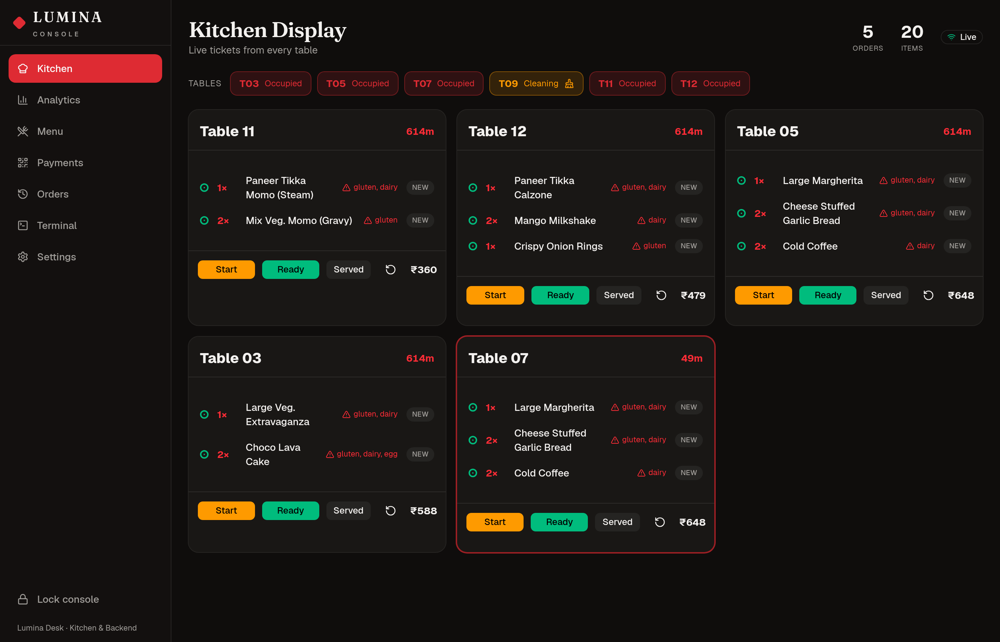

</div>

---

## What is this, actually?

Put a small ePaper screen and a microphone on a restaurant table.

A guest sits down, says **"Hey Lumina, one large Margherita and two cold coffees"**,
and three things happen at once:

1. **Lumina answers out loud** — "Got it, one Large Margherita and two Cold Coffees. Anything else?"
2. **The screen on the table updates** — every item, the price, what it contains, the running bill, and how long the food will take.
3. **The kitchen sees the ticket instantly** — on a browser dashboard, with allergens flagged.

When they're done they say *"bill please"*, a UPI QR appears on the table screen
for the exact amount, they pay from their phone, and the screen says thank you.
Nobody had to fetch a menu, take an order, or bring a bill.

That's the whole product. Everything below is how it's built.

> **This is running in a real pure-veg pizza outlet** — Auntyno-Z Pizza, Ghodasar —
> with all **189 dishes** from their actual menu, sizes and all.

<div align="center">

|  |  |
|:--:|:--:|
|  | 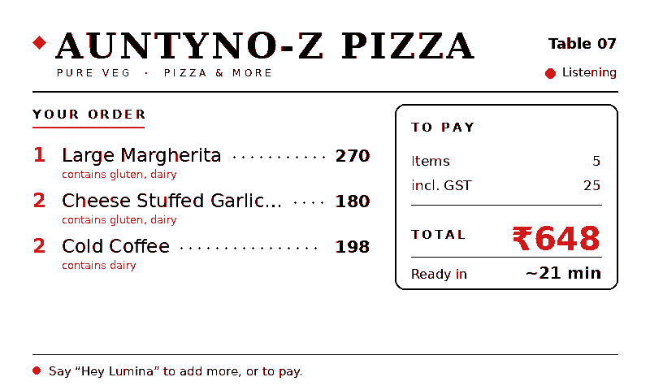 |
| **Waiting** — invites the guest, shows what they can say | **Ordering** — items, allergens, bill, ready-time |
| 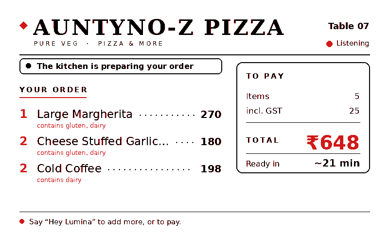 | 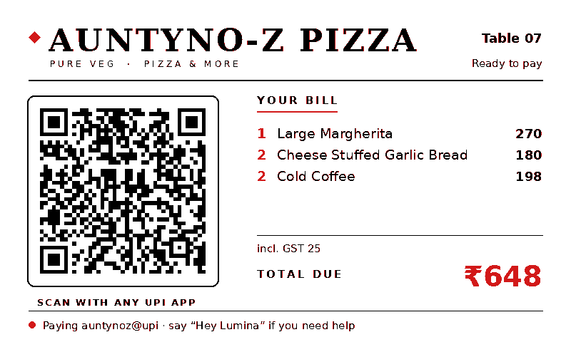 |
| **Cooking** — the kitchen's status comes back to the table | **Paying** — dynamic UPI QR for this exact bill |
| 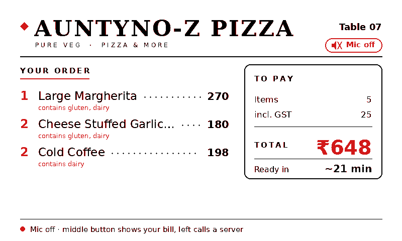 | 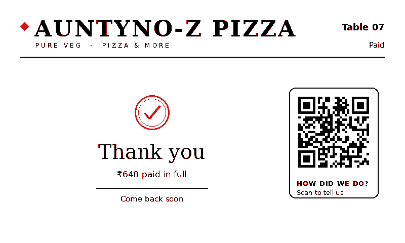 |
| **Mic off** — the device is released, not just ignored | **Done** — settled, with a feedback QR |

*These are the real 800×480 renders, generated by `ui_render.py`.*

</div>

---

## Why it's interesting

Most "AI ordering" demos fall apart the moment a real guest speaks. This one is
built around the ways they actually fail:

| The hard part | What Lumina does |
|---|---|
| **The model invents a dish or a price** | The LLM only *classifies and phrases*. Prices, totals, ETAs and allergens are computed in Python from the menu. Every dish name it returns is grounded against the real menu — it physically cannot bill you for something that doesn't exist. |
| **"No wait, I said pepperoni"** | The model sees the conversation *and* the current cart, so corrections, negation and pronouns ("add it", "remove one") work. |
| **"Is there egg in this?"** | Allergen and ingredient questions are forced down a deterministic path. It reads from the database, never from the model's memory. |
| **The internet dies mid-service** | Offline mode makes **zero network calls** — wake word, speech recognition, understanding, speech and display all run on the Pi. |
| **Offline is unusably slow** | A 700M model on a Pi CPU needs ~9 s. So offline tries a **rule parser first** — instant and reliably right for the handful of things guests actually say. Measured: **0.1–5.6 ms** for common turns. |
| **The guest doesn't speak English** | Whatever language they use, Lumina replies in it. |
| **A shy guest, or a very loud room** | Three physical buttons on the panel: call a waiter, show the bill, mute. |
| **The next party inherits the last bill** | The table has a lifecycle. Payment banks the order, clears the ticket, resets the voice session and flips the table to *cleaning*. |

---

## The staff side

Everything runs from one browser page on the LAN — `http://<pi>.local:8000`,
behind a staff PIN. It works on a phone, a tablet propped in the kitchen, or the
till computer.

### Kitchen — the live board
Tickets as they're spoken, wait timers that turn amber then red, allergens in red,
and one-tap New → Preparing → Ready → Served. Guest requests ("bring water") and
payment requests raise their own banner until someone clears them.


### Analytics — is the shop doing well?
Revenue, average ticket, how long an order takes from spoken to served, peak hour,
busiest tables, and what people actually order.

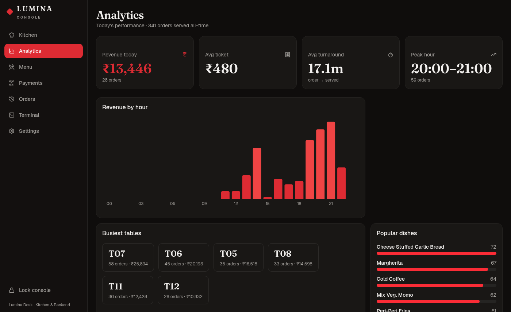

### Menu — change the menu by typing
Edit a price, mark something sold out, or add a new dish. It becomes orderable by
voice **immediately** — no restart, no redeploy.

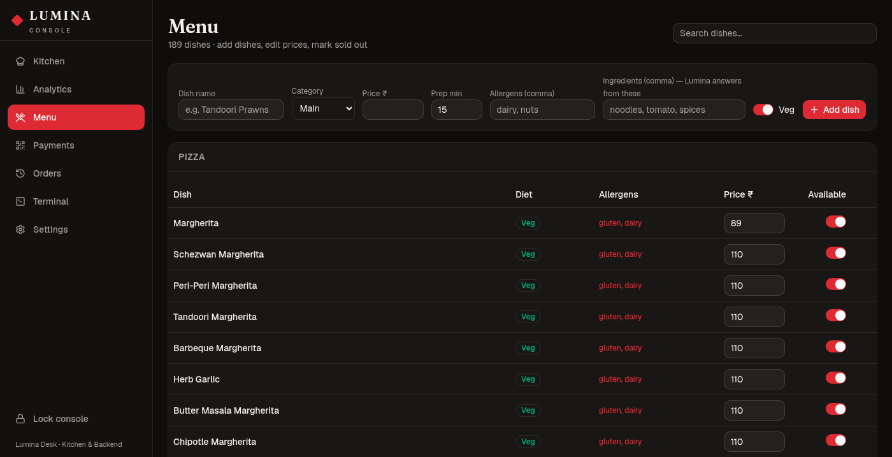

### Payments — dynamic UPI QR
One VPA, a different amount per bill. Generates the QR, exposes a webhook for a
real gateway, and keeps a log of every bill and how it settled.

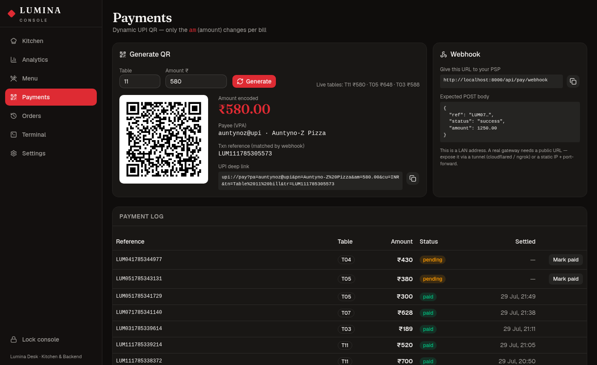

### Orders — every ticket ever served
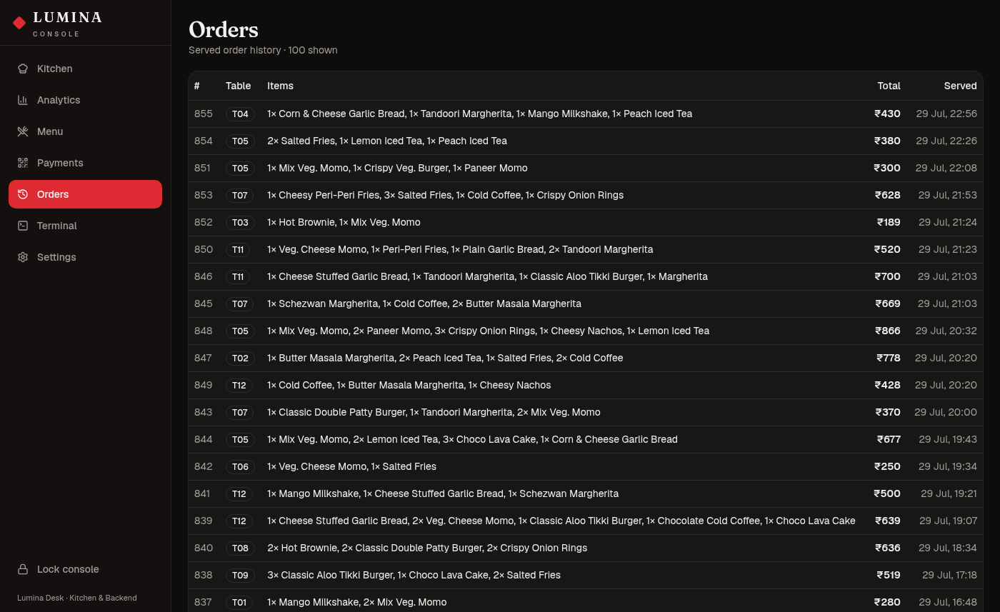

### Terminal — logs without SSH
The actual `journalctl` output of every service, live, in the browser. This is how
you debug a table from your phone while standing in the shop.

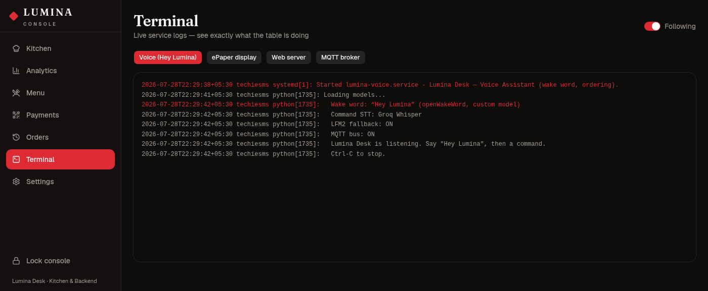

### Settings — everything tunable, live
Assistant on/muted/off, online vs offline brain, API key, tax, UPI ID, wake-word
sensitivity, how long a pause means "I've finished talking", and the staff PIN.
Changes apply within a second.

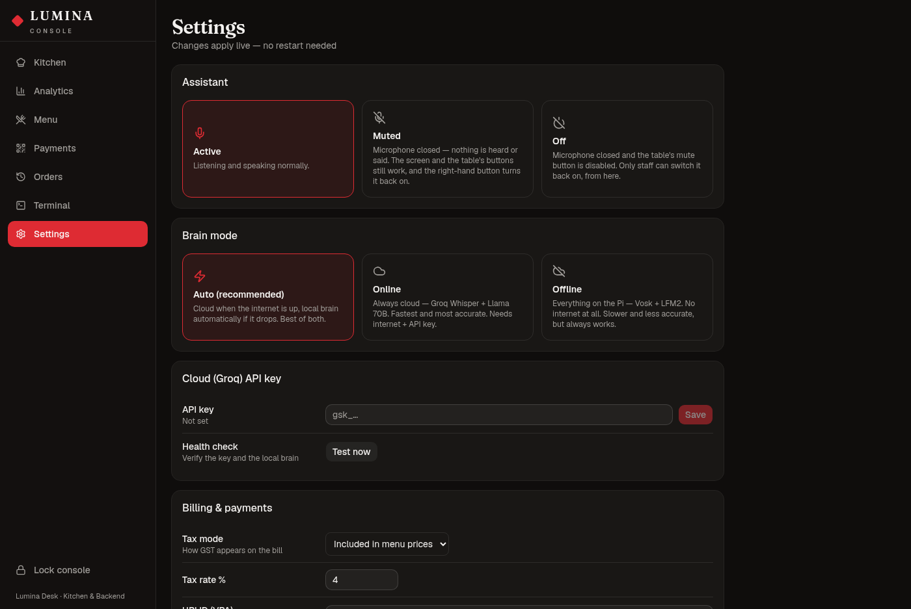

---

## How it works

```
   Guest speaks                 Raspberry Pi 5                      Staff
  ┌───────────────┐     ┌────────────────────────────┐     ┌─────────────────┐
  │ "Hey Lumina,  │────▶│  wake word → STT → LLM     │────▶│  Kitchen board  │
  │  one large    │     │       ↓                    │     │  (any browser)  │
  │  Margherita"  │     │  grounded in menu.py       │     └────────┬────────┘
  └───────────────┘     │  MQTT bus (mosquitto)      │              │
          ▲             └─────────────┬──────────────┘              │ "Ready"
          │ spoken reply              │ frames over WiFi            │
          │ (Piper TTS)               ▼                             ▼
          └────────────────────  ePaper panel  ◀──────  status back to the table
```

### The pipeline, step by step

1. **Wake word** — openWakeWord runs a custom `hey_lumina.onnx` on-device. No cloud, no keyword service.
2. **Capture** — a background thread constantly drains the mic so ALSA never overflows. An energy-based VAD records exactly one sentence and throws away noise.
3. **Speech → text** — Groq Whisper (`whisper-large-v3-turbo`), primed with the live menu so dish names transcribe correctly. Vosk when offline.
4. **Understanding** — the LLM gets the conversation, the cart and the real menu. Groq `llama-3.3-70b-versatile` online; LFM2-700M via Ollama offline.
5. **Facts stay in code** — the model returns *intent*; `menu.py` and `session.py` compute money, time and allergens.
6. **Reply** — Piper neural TTS runs as a resident process and streams audio as it generates, so the first word lands fast.
7. **Publish** — order and status go onto MQTT; the display service renders an 800×480 image with Pillow and streams it to the panel over WiFi.

### Why an MQTT bus

Everything is decoupled. The voice app publishes; the display service and the
kitchen dashboard subscribe. Adding a second table, a kitchen screen, or a
dashboard is just another subscriber — no changes to existing code.

```
lumina/table/<id>/order      full order + bill snapshot (retained)
lumina/table/<id>/kitchen    preparing | ready | delayed | served
lumina/table/<id>/pay        UPI link for the ePaper QR
lumina/table/<id>/payment    "paid"
lumina/table/<id>/event      staff_called | service_request | pay_requested
lumina/table/<id>/state      available | reserved | occupied | cleaning
lumina/table/<id>/button     front-panel keys
lumina/table/<id>/frame      packed 800×480 image chunks → panel
lumina/assistant             active | muted | off (house-wide)
```

---

# Build one yourself

This section assumes you've flashed a Raspberry Pi before and nothing else.
Take it in order; each step ends with something you can check.

## Step 0 — What you need

| Part | What I used | Roughly | Required? |
|---|---|---|---|
| Computer | **Raspberry Pi 5, 8 GB** | ₹8,000 | Yes — a Pi 4 works but the local model is slower |
| Microphone | **reSpeaker XVF3800 4-Mic Array (USB)** | ₹6,000 | Yes — a cheap USB mic will hear the room, not the guest |
| Speaker | Any powered speaker into the reSpeaker's out | ₹500 | Yes |
| Table screen | **Seeed reTerminal E1002** — ESP32-S3 + 7.5" 800×480 colour ePaper, WiFi + battery | ₹7,000 | Optional — the voice half works without it |
| *(cheaper screen)* | **XIAO 7.5" ePaper Panel** (ESP32-C3, mono, UC8179) | ₹4,000 | Faster refresh, no colour |
| SD card | 32 GB A2 | ₹600 | Yes |

You also need a free **[Groq API key](https://console.groq.com)** for the fast
online mode. It costs nothing and takes a minute. (You can skip it and run fully
offline — see [Online vs offline](#online-vs-offline).)

## Step 1 — Get the code onto the Pi

Flash **Raspberry Pi OS (64-bit)**, boot it, connect to WiFi, then:

```bash
git clone https://github.com/Shubhjaiswal408/lumina-desk-smart-restaurant.git ~/lumina-desk
cd ~/lumina-desk
```

## Step 2 — System packages

```bash
sudo apt update
sudo apt install -y python3-venv python3-scipy python3-sklearn \
    espeak-ng libportaudio2 mosquitto mosquitto-clients avahi-daemon
```

Let other devices on your WiFi reach the message broker — create
`/etc/mosquitto/conf.d/lumina.conf`:

```
listener 1883 0.0.0.0
allow_anonymous true
persistence true
```

```bash
sudo systemctl restart mosquitto
```

**Check:** `mosquitto_sub -t 'test' -v &` then `mosquitto_pub -t test -m hi`
should print `test hi`.

## Step 3 — Python

```bash
cd ~/lumina-desk
python3 -m venv --system-site-packages venv
./venv/bin/pip install sounddevice openwakeword vosk requests paho-mqtt \
    fastapi "uvicorn[standard]" pillow qrcode pyserial
```

## Step 4 — Find your microphone

```bash
arecord -l
```

Note the card number (mine is card 2) and set `RESPEAKER_CARD` in `config.py`.
Then run `./venv/bin/python -c "import sounddevice; print(sounddevice.query_devices())"`
and set `INPUT_DEVICE_INDEX` to the reSpeaker's input index.

**Check:** `arecord -D plughw:2,0 -f S16_LE -r 16000 -c 1 -d 3 t.wav && aplay t.wav`
— you should hear yourself.

## Step 5 — The voices and models

**Piper (the voice)** — grab the `linux_aarch64` build from
[rhasspy/piper releases](https://github.com/rhasspy/piper/releases) and extract it
so the binary sits at `piper/piper`. Then a voice:

```bash
mkdir -p voices && cd voices
BASE=https://huggingface.co/rhasspy/piper-voices/resolve/main
wget $BASE/en/en_US/amy/medium/en_US-amy-medium.onnx
wget $BASE/en/en_US/amy/medium/en_US-amy-medium.onnx.json
# optional, for Hindi replies:
wget $BASE/hi/hi_IN/priyamvada/medium/hi_IN-priyamvada-medium.onnx
wget $BASE/hi/hi_IN/priyamvada/medium/hi_IN-priyamvada-medium.onnx.json
cd ..
```

Any other language still works — it falls back to espeak-ng, which covers ~100
languages. It sounds robotic, but it's understood.

**Vosk (offline speech recognition)**:

```bash
wget https://alphacephei.com/vosk/models/vosk-model-small-en-us-0.15.zip
unzip vosk-model-small-en-us-0.15.zip
```

**Ollama + LFM2 (the offline brain)** — install Ollama from
[ollama.com](https://ollama.com/download/linux), then:

```bash
ollama pull hf.co/LiquidAI/LFM2-700M-GGUF
```

**Your Groq key**:

```bash
echo 'gsk_your_key_here' > ~/lumina-desk/.groq_key
chmod 600 ~/lumina-desk/.groq_key
```

## Step 6 — The wake word

`models/hey_lumina.onnx` is included, so this works out of the box.

To train your own phrase, open `training/hey_lumina_advanced.ipynb` in
**Google Colab** and run it. It synthesises thousands of spoken samples — you
never record your own voice — and takes about 45 minutes on the free tier. Drop
the resulting `.onnx` into `models/` and set `OWW_MODEL` in `config.py`.

## Step 7 — Build the console

```bash
cd ~/lumina-desk/admin
npm install && npm run build      # writes into ../static/admin/
cd ..
```

## Step 8 — Start everything

```bash
sudo cp systemd/*.service /etc/systemd/system/
sudo systemctl daemon-reload
sudo systemctl enable --now lumina-voice lumina-display lumina-kds lumina-payments
```

**Check:** open `http://<your-pi-hostname>.local:8000` from your phone. Log in
with PIN `0000`, then **change it in Settings immediately.**

Now say **"Hey Lumina, one large Margherita."** It should answer, and the ticket
should appear on the Kitchen page.

## Step 9 — Make it your restaurant

Open **Settings** in the console and set:

- **Restaurant name** — it's printed on the table screen
- **UPI ID** — where the money lands
- **Tax mode** — included in prices, or added on top
- **Staff PIN**

Then replace the menu. `menu.py` is a plain Python list — one entry per dish:

```python
_pizza("Margherita", 89, 220, 270,          # regular / medium / large
       [],                                   # extra toppings on top of the base
       ["margherita", "margarita", "plain pizza"],
       desc="Margherita Magic, 100% Amul mozzarella"),
```

That third argument is the important one: it's what the guest might *actually
say*, including the ways people mispronounce it. Get those right and recognition
improves more than any model change will.

For one-off additions you don't need to touch code at all — the **Menu** page in
the console adds dishes live.

## Step 10 — The table screen (optional)

```bash
cp firmware/display_wifi/wifi_secrets.h.example firmware/display_wifi/wifi_secrets.h
# fill in your WiFi name/password and the Pi's hostname, then:
arduino-cli compile --upload -p /dev/ttyUSB0 \
  --fqbn 'esp32:esp32:XIAO_ESP32S3:PSRAM=opi,CDCOnBoot=cdc' firmware/display_wifi
```

Unplug the USB cable — it runs on battery over WiFi, and finds the Pi by **mDNS**,
so the Pi's IP address can change without breaking anything.

---

## Living with it

### Panel buttons

The three front keys give guests a silent path to service — useful in a loud room,
for a shy guest, or when the assistant is muted. Active-low on GPIO 2/3/5, with a
short beep on the GPIO 45 buzzer so the guest knows the press registered.

| Key | Action |
|---|---|
| **Left** | Call a waiter — raises the alert on the kitchen board |
| **Middle** | Show the bill + UPI QR on the screen |
| **Right** | Mute / unmute the assistant |

### Assistant state

From **Settings → Assistant**, or the right-hand panel button:

- **Active** — listening and speaking.
- **Muted** — **the microphone is closed.** Not "we ignore what it hears" — the
  ALSA device is released, so the reSpeaker's LED ring goes dark and a guest can
  see that nothing is being recorded. The screen and the panel buttons keep
  working, and the right-hand button turns it back on.
- **Off** — same, plus the panel's mute button stops working. *Off* is a
  manager's decision from the console; the floor can't quietly undo it.

In both states the table still works — the middle button shows the bill, the left
button calls a server — and the panel says so instead of inviting people to talk
to a microphone that isn't listening.


### Online vs offline

Set in **Settings → Brain mode**. Applies within a second, no restart.

| Mode | Speech → text | Understanding | Speed | Internet |
|---|---|---|---|---|
| **Auto** *(default)* | Groq Whisper → Vosk | Groq 70B → LFM2 | ~0.4 s | Not required |
| **Online** | Groq Whisper | Groq 70B | ~0.4 s | Required |
| **Offline** | Vosk | Rules → LFM2-700M | **~5 ms** typical, ~9 s for unusual phrasing | **None at all** |

Offline genuinely makes zero network calls. Its one real weakness is **speech
recognition** — Vosk's small model is less accurate than cloud Whisper at
conversational distance across a noisy room. **Auto is the recommendation:** cloud
accuracy when the line is up, local resilience when it isn't.

### Payments

The QR encodes a standard NPCI deep link where only the amount changes:

```
upi://pay?pa=<vpa>&pn=<payee>&am=<AMOUNT>&cu=INR&tn=<note>&tr=<ref>
```

A plain UPI QR has **no webhook**, so confirming that money actually arrived works
one of three ways:

1. **Payment emails** (`payment_watcher.py`) — FamApp emails the merchant on every
   incoming payment. The watcher reads that mailbox over IMAP and settles the
   matching bill. Needs a Gmail **App Password** in `.gmail_key`. Matching is by
   amount + recency, deduplicated by the transaction ID, oldest bill first.
2. **A real gateway** — `POST /api/pay/webhook` with
   `{"ref":"LUM07…","status":"success","amount":1250}` is already implemented.
3. **Manual** — every pending row on the Payments page has a **Mark paid** button.

> **Limitation:** two tables owing the exact same amount at the same moment could
> mismatch under (1). A real gateway with per-bill references removes that.

### Table lifecycle

```
available → occupied → (paid) → cleaning → available
                ↑                              ↓
             reserved  ←──── staff set from the console
```

On payment the order is banked to history. After 45 s — long enough for the slow
colour panel to finish drawing the thank-you — the ticket clears, the voice
session resets so the next party starts fresh, and the table drops to *cleaning*.

---

## Repository layout

```
wake_listen.py      main voice loop: wake → listen → understand → reply
audio.py            background mic capture (kills ALSA overflow)
stt.py              VAD recording + Groq Whisper / Vosk
llm.py              LLM understanding, grounding + safety guards
intents.py          instant rule parser (the offline fast path)
dialog.py           intent → spoken reply; updates the session
menu.py             the menu: prices, sizes, allergens, tax, admin overrides
session.py          per-table cart, bill maths, ETA
tts.py              Piper (resident process) + espeak fallback
lang.py             language detection → voice / espeak codes
mqtt_bus.py         topics + publish/subscribe helpers

kds_server.py       FastAPI: dashboard API, WebSocket, table lifecycle, auth
kds_data.py         SQLite: order history, analytics, menu overrides, payments
payments.py         dynamic UPI deep link + QR
payment_watcher.py  settles bills by reading payment emails (IMAP)
display_service.py  renders + streams frames to the panel
ui_render.py        the 800×480 ePaper design system (Pillow)
settings.py         runtime settings overlay (settings.json)

admin/              React + TypeScript + Tailwind + shadcn/ui console
firmware/           ESP32 sketches (WiFi panel, USB panel, hardware tests)
systemd/            service units — everything auto-starts on boot
training/           Colab notebook to train your own wake word
docs/images/        the screenshots in this README
```

Regenerate the ePaper images any time with `./venv/bin/python ui_render.py`.

---

## Security notes

- The console sits behind a **staff PIN**; tokens live in memory and die on restart.
- `/api/pay/webhook` is deliberately unauthenticated so a payment gateway can reach
  it. **Add signature verification before exposing it to the internet.**
- Secrets are gitignored and never committed: `.groq_key`, `.gmail_key`,
  `settings.json`, `firmware/*/wifi_secrets.h`, `lumina.db`.
- `config.py` ships **placeholders only**. Real values (PIN, UPI ID, email) live in
  `settings.json` on the device.
- This is designed for a **LAN**. Don't port-forward it to the internet as-is.

---

## Troubleshooting

| Symptom | Cause / fix |
|---|---|
| `ALSA input overflow` | Fixed — `audio.py` drains the mic on a background thread. If it returns, another process is holding the card. |
| Panel stuck on an old screen | Check `journalctl -u lumina-display -f`. The firmware resolves the Pi by mDNS, so an IP change shouldn't matter. |
| Panel blank on first flash | The ePaper ribbon (FPC) isn't seated. `epaper.begin()` will hang on BUSY forever. Reseat it. |
| ESP32 serial silent | The reTerminal E1002 needs `CDCOnBoot=cdc` in the FQBN to route Serial to the CH340. |
| `[pay] no pending bill matched` | Payment arrived with no matching open bill, or older than the 45-minute window. |
| Wake word too eager / too deaf | Settings → wake sensitivity (0.3–0.7). |
| Guest gets cut off mid-sentence | Settings → end-of-speech pause; raise it to 0.8–1.0 s. |
| Console won't load after a restart | Tokens are in-memory. Log in again. |
| Two dashboards fighting | Fixed — MQTT client ids are randomised per process. Two clients sharing an id silently disconnect each other. |

Logs: `journalctl -u lumina-voice -f`, or just open the **Terminal** page.

---

## Honest limitations

- **Colour ePaper refresh is ~15–20 s.** That's the panel, not the software. The
  mono UC8179 panel refreshes in ~4–6 s and supports partial refresh.
- **One Pi per table.** The dashboard aggregates any number of tables, but each
  table needs its own Pi, mic and panel. That's the real cost driver.
- **Offline mode is slower and less accurate** than cloud — mostly because of
  speech recognition, not understanding.
- **Free-tier Groq has rate limits.** Normal conversation is comfortably inside
  them; a stress test isn't.
- **Payment matching by email is heuristic.** Use a real gateway if you can.

---

## Licence

MIT — see [LICENSE](LICENSE). Build one, sell one, change it, no permission needed.

<div align="center">

**If this was useful, a ⭐ helps other people find it.**

</div>
